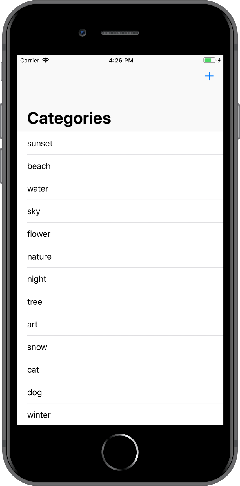
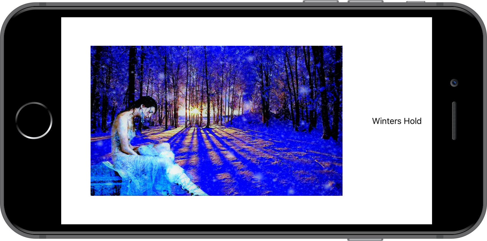

## Summary
Adaptive Flickr is a practice app using SplitViewController, sizeClasses, and dynamic text types for users using Accessibility size fonts.

## Images using iPhone 8 Plus

### Compact Width, Regular Height

### Regular Width, Compact Height

### Accessibility Max Text Size

